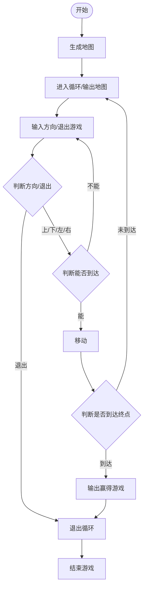

# C/C++学习笔记

# 记录你学习过程中的所见所思！酸甜苦辣！

## 2026.9.20
刚发现这个文档，开始写啦OvO

###  level1\p01_running_letter
```C++
HANDLE screen = GetStdHandle(STD_OUTPUT_HANDLE); //这是光标
CONSOLE_CURSOR_INFO cursor;
GetConsoleCursorInfo(screen, &cursor); //读出光标的设置
cursor.bVisible = true; //设置隐藏光标
SetConsoleCursorInfo(screen, &cursor); //将隐藏的设置写回光标
//------------这是一条分割线------------
CONSOLE_SCREEN_BUFFER_INFO info;
GetConsoleScreenBufferInfo(screen, &info); //读出当前窗口长
int width = info.srWindow.Right - info.srWindow.Left + 1; //这是窗口长
//------------这是另一条分割线------------
cout.flush(); //刷新缓冲区，立即显示
Sleep(delayMs); //停顿
```
上面是一大部分的系统设置，剩下的就很简单了，略~


### level1\p02_is_prime
直接过。


### level1\p03_all_primes
```C++
//一段计时器
auto t0 = chrono::steady_clock::now();
auto t1 = chrono::steady_clock::now();
double ms = chrono::duration<double, std::milli>(t1 - t0).count();
cout << "Total execution time: " << ms << "ms\n";
```
《关于埃筛和线性筛哪个快之我太懒了不想试》


### level1\p04_hanoi
##### 汉诺塔还在追我~
略~


### level1\p5_maze
依然是大量的关于命令行等的代码
```C++
//读取上下左右的指令
int readKey() {
    int c = _getch();
    if (c == 0 || c == 224) {           // 方向键的前导字节
        int c2 = _getch();
        if (c2 == 72) return KEY_UP;
        if (c2 == 80) return KEY_DOWN;
        if (c2 == 75) return KEY_LEFT;
        if (c2 == 77) return KEY_RIGHT;
        return KEY_OTHER;
    }
    if (c == 'q' || c == 'Q') return KEY_QUIT;
    return KEY_OTHER;
}

//挖出迷宫
void digdig(int x, int y) {
    maze[x][y] = ' ';
    int tx[4] = {0, 0, -2, 2}, ty[4] = {-2, 2, 0, 0};
    for (int i = 1; i <= 10; i++) {
        int o = mt() % 4, s = mt() % 4;
        swap(tx[o], tx[s]);
        swap(ty[o], ty[s]);
    }
    for (int i = 0; i <= 3; i++) {
        int nx = x + tx[i], ny = y + ty[i];
        if (nx > 0 && nx < WIDTH && ny > 0 && ny < HEIGHT && maze[nx][ny] == '#') {
            maze[(x + nx) >> 1][(y + ny) >> 1] = ' ';
            digdig(nx, ny);
        }
    }
}
```
考虑代码流程：


### o((>ω< ))o))